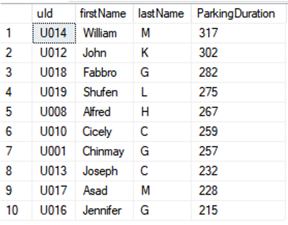
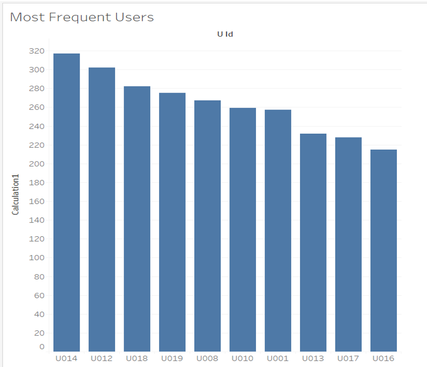
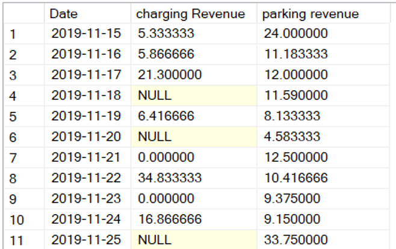
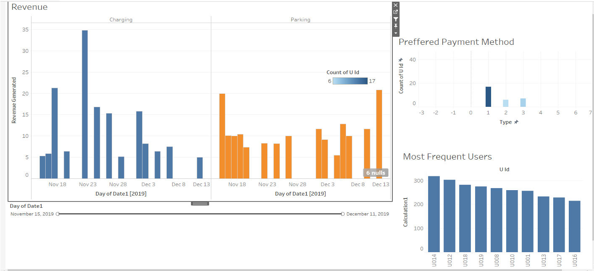

# Green_Terps

Mission Objective: An efficient, secure and robust database to handle daily transactions between a user and an Electric vehicle charging station at the University of Maryland, College Park. 
 
Mission Statements:

1. Proactively updating the database to keep transactions robust and secure. 
2. Respond to stakeholder requests.
3. To have meaningful relationships between entities. To have fewer complexities between the entities
4. To keep a track of revenue generated from each station daily.

Types of Users:

There are 2 types of users that will interact with the database.
1.Electric Vehicle user: Faculty, Staff, Students, Visitors 
2.DOTS

Data Sources:

Interaction between the car driver and payment gateway.
When a new vehicle is registered with DOTS.
When a new user registers with DOTS.
When a new permit is issued by DOTS to a user
When a new parking/charging position is filled

Logical Database Design:

User (uId, firstName, lastName, contactInfo, dateOfBirth, userType, hasPermit)

Sensor (sensorId, stnId, sensorStatus )

Vehicle (vehicleId, uId, vehicleModel, vehicleColor, vehicleStyle, vehicleMake)

Station (stnId, dptId, chargingRatePerHour, serviceType, parkingRatePerHour, parkingCapacity, stnName, locLat, locLong)

PaymentGateway (pId, dptId, uId, type)

DOTS (dptId, dptName, dptPhnNo)

Subscribes (uId, dptId, startDate, endDate, discount)

Allocate (vehicleId, uId, sensorId )

GeneratesReport (sensorId, pId, startTimeChrg, endTimeChrg, startTimePrkng, endTimePrkng, date)

Fig 1 : Top ten frequent users of dots

Fig 2 : Visualization of top ten frequent users of dots

Fig 3: Revenue generated by DOTS for all the dates

Fig 4: Visualization of revenue generated by DOTS for all the dates

